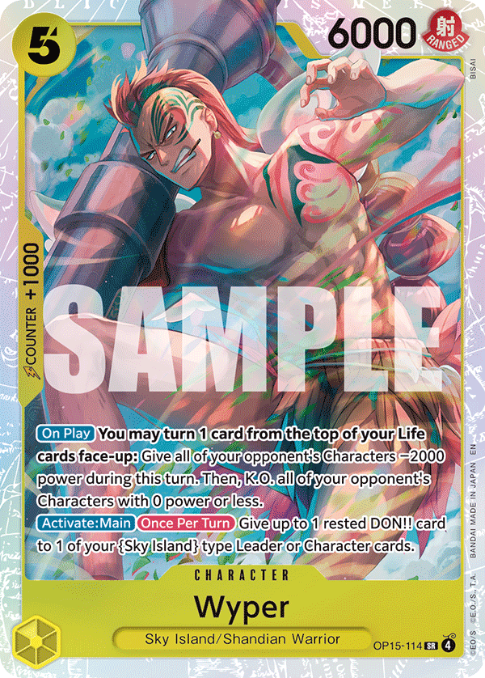
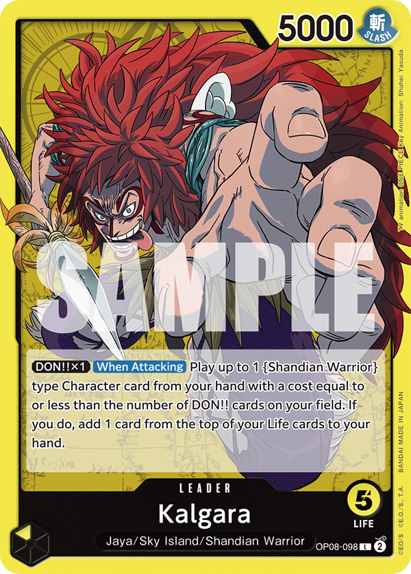
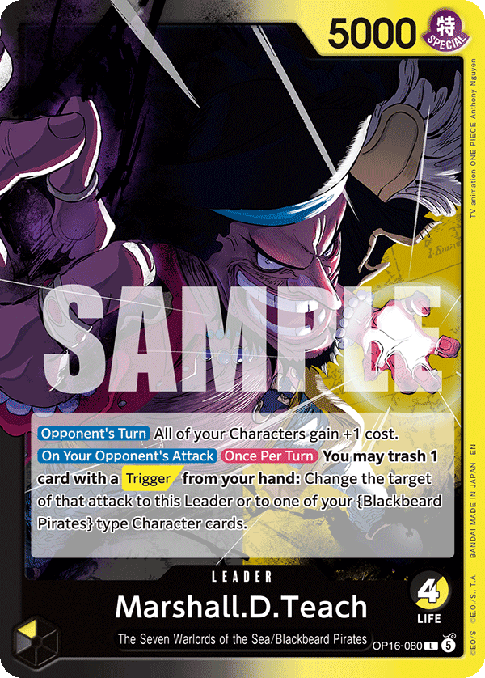
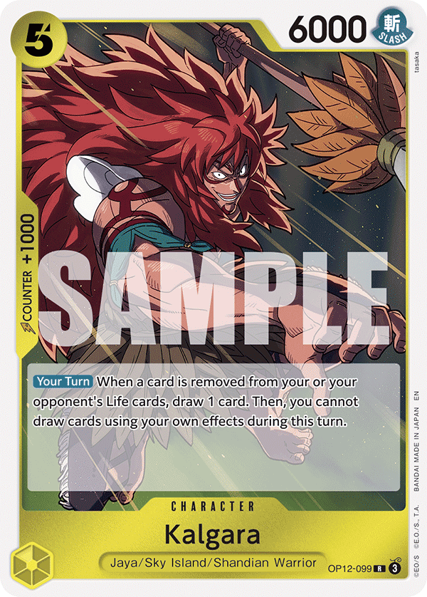
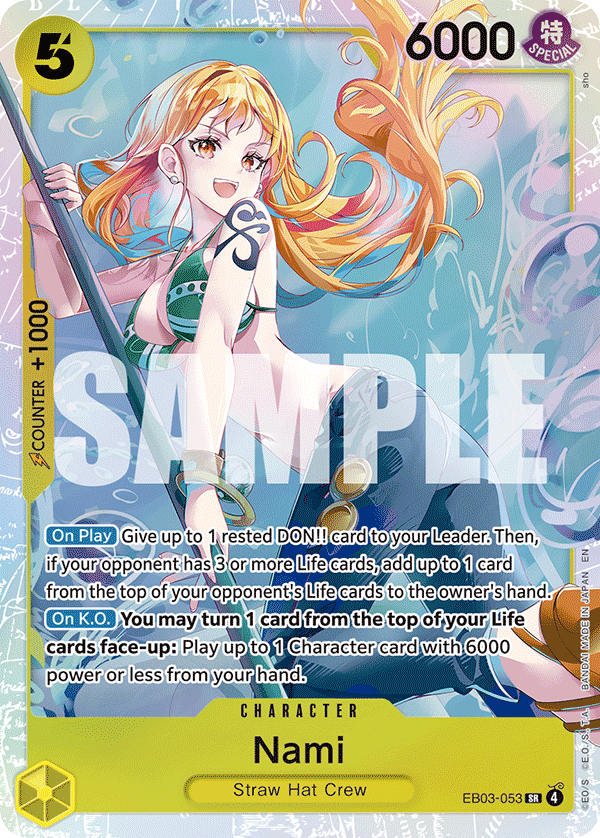
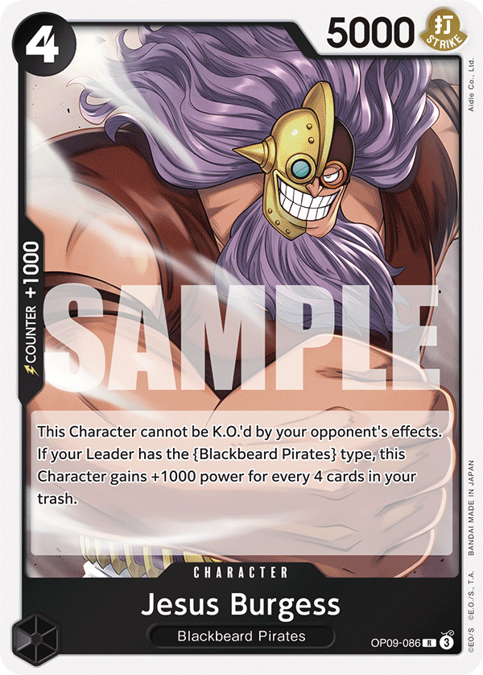
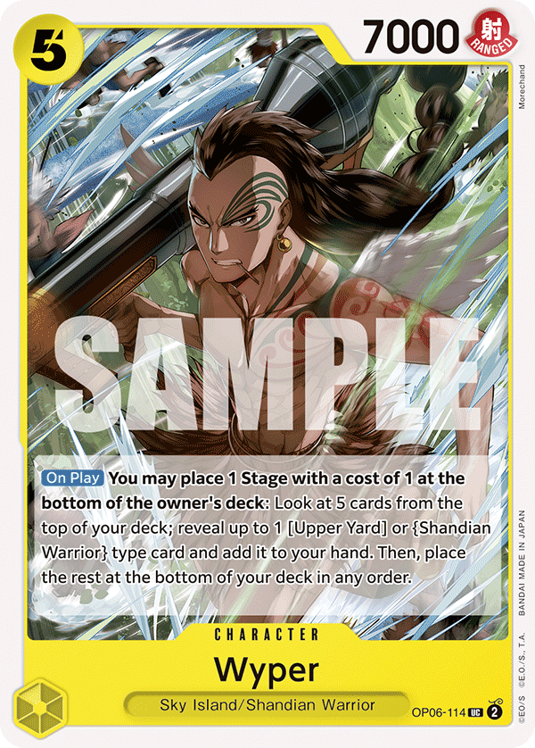
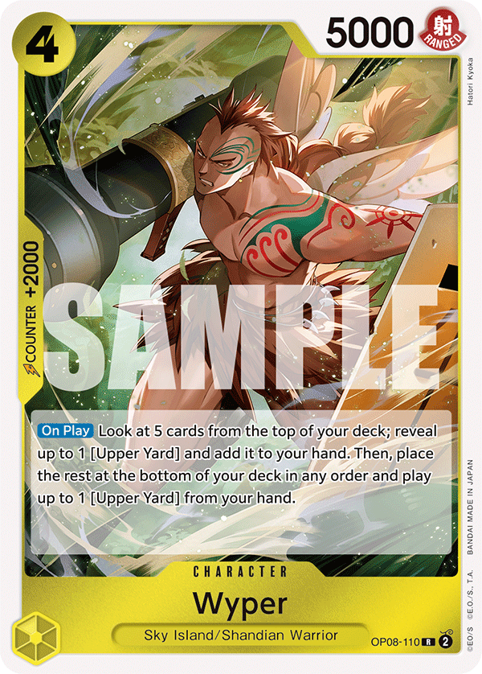
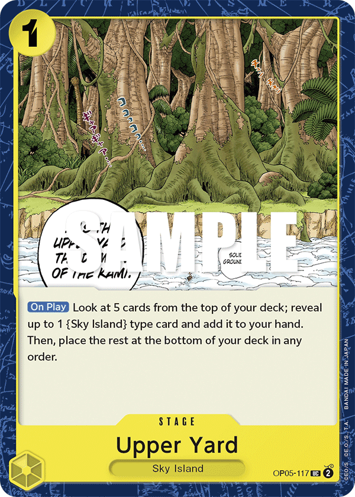
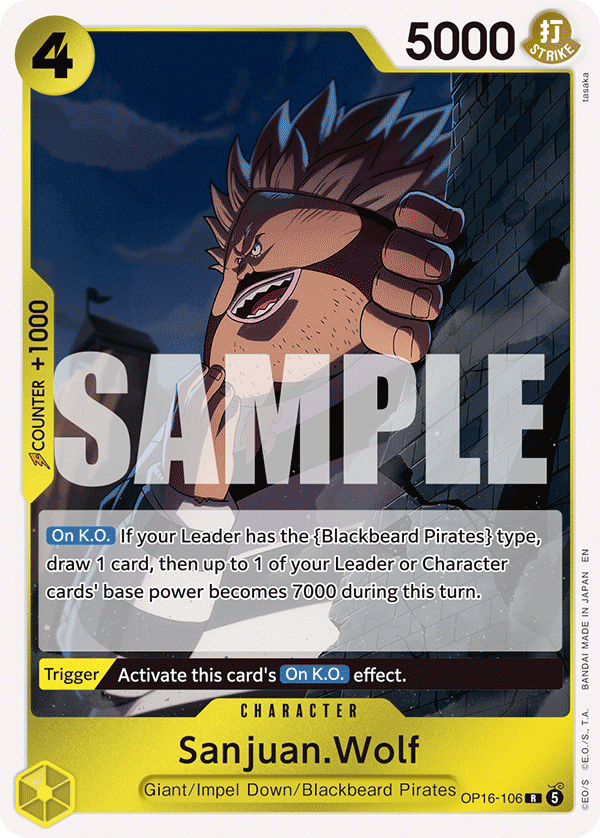

# Kalgara vs Teach — 5-DON Turn Analysis

**Date:** 2026-06-28
**Source:** OPBounty replay collection — standard queue (game_mode=0), top-200 ladder or 3000+ bounty pilots only.
**Replays loaded:** 246
**With at least one Kalgara 5-DON turn:** 130
**Kalgara win rate in this sample:** 134/244 = 54.9%

**Method:** For each replay, find Kalgara's turn whose `don_at_start == 5`. Take the action sequence on that turn — `deploy`, `attach_don`, `attack`, `counter`, plus structured leader-effect tokens (`effect_deploy:<card>` for Kalgara's post-attack 'Deploy from hand', `effect_top_life`, `send_life`, `effect_attach_don`, `effect_revive`). Snapshot, combat-resolve and informational effect lines are dropped. Group by the first 5 meaningful tokens.

Card legend (Kalgara core): `OP15-114` = 5c Wyper, `OP08-098` = Kalgara leader, `OP08-099` = 4c New Kalgara, `OP12-099` = leader-effect Kalgara, `OP06-114` = Wyper (rev), `EB03-053` = Zeus/Nami, `OP05-117` = Earth Won't Lose counter.

## Going 1st — top 10 5-DON openings

**125 5-DON turns** observed going 1st.

| Freq | Wins | WR | Tokens |
|---:|---:|---:|---|
| 16 | 4 | 25% | <table><tr><td></td><td></td><td></td><td></td><td></td></tr><tr><td>play</td><td>+1R DON</td><td>attack leader</td><td>leader plays</td><td>take top life</td></tr></table> |
| 10 | 5 | 50% | <table><tr><td></td><td></td><td></td><td></td><td></td></tr><tr><td>play</td><td>+1R DON</td><td>send 1 life</td><td>attack leader</td><td>leader plays</td></tr></table> |
| 10 | 8 | 80% | <table><tr><td></td><td></td><td></td><td></td><td></td></tr><tr><td>attack leader</td><td>play</td><td>+1R DON</td><td>attack leader</td><td>leader plays</td></tr></table> |
| 7 | 4 | 57% | <table><tr><td></td><td></td><td></td><td></td><td></td></tr><tr><td>play</td><td>+1R DON</td><td>send 1 life</td><td>attack leader</td><td>leader plays</td></tr></table> |
| 4 | 1 | 25% | <table><tr><td></td><td></td><td></td><td></td><td></td></tr><tr><td>attack leader</td><td>play</td><td>+1R DON</td><td>send 1 life</td><td>attack leader</td></tr></table> |
| 3 | 2 | 67% | <table><tr><td></td><td></td><td></td><td></td><td></td></tr><tr><td>attack leader</td><td>counter -1000</td><td>play</td><td>+1R DON</td><td>send 1 life</td></tr></table> |
| 3 | 3 | 100% | <table><tr><td></td><td></td><td></td><td></td><td></td></tr><tr><td>+1 DON</td><td>attack leader</td><td>leader plays</td><td>take top life</td><td>effect</td></tr></table> |
| 2 | 2 | 100% | <table><tr><td></td><td></td><td></td><td></td><td></td></tr><tr><td>attack leader</td><td>counter -2000</td><td>play</td><td>+1R DON</td><td>send 1 life</td></tr></table> |
| 2 | 1 | 50% | <table><tr><td></td><td></td><td></td><td></td><td></td></tr><tr><td>attack leader</td><td>play</td><td>leader plays</td><td>+1 DON</td><td>attack leader</td></tr></table> |
| 2 | 0 | 0% | <table><tr><td></td><td></td><td></td><td></td><td></td></tr><tr><td>attack leader</td><td>counter -1000</td><td>play</td><td>+1R DON</td><td>attack leader</td></tr></table> |

## Going 2nd

**0 valid 5-DON turns going 2nd.** Kalgara has no DON acceleration on its 2-4-6-8-10 curve, so a 5-DON turn going 2nd is structurally impossible. **5 rows were observed in the raw data and dropped** — they indicate a DON-tracking bug in `parser.py` (suspects: `Activate N Don` double-counting, an unseen `Return N Don` variant, or `effect_attach_don` adding DON for a player-prefixed `Attach N Don to X` line that the main `_RE_ATTACH_DON` regex also counts). Filed as a follow-up; not fixed in this report.

## Card-level: what gets PLAYED on the 5-DON turn?

Includes both hard-paid deploys (`deploy:`) and leader-effect plays from hand (`effect_deploy:` — Kalgara's post-attack reward).

| Card id | Plays | Wins-when-played | WR | Source |
|---|---:|---:|---:|---|
| `OP12-099` | 77 | 34 | 44% | effect_deploy |
| `OP15-114` | 71 | 31 | 44% | hand+leader |
| `EB03-053` | 45 | 26 | 58% | deploy |
| `OP15-101` | 16 | 7 | 44% | hand+leader |
| `OP05-117` | 11 | 5 | 45% | hand+leader |
| `OP08-110` | 10 | 5 | 50% | hand+leader |
| `OP06-114` | 9 | 5 | 56% | effect_deploy |
| `OP15-111` | 3 | 1 | 33% | deploy |
| `OP15-113` | 3 | 2 | 67% | deploy |
| `OP15-119` | 2 | 1 | 50% | deploy |
| `OP09-099` | 2 | 2 | 100% | effect_deploy |
| `OP15-108` | 2 | 0 | 0% | deploy |
| `OP15-110` | 2 | 0 | 0% | deploy |
| `OP05-106` | 1 | 0 | 0% | deploy |
| `OP06-102` | 1 | 0 | 0% | deploy |
| `OP16-106` | 1 | 0 | 0% | effect_deploy |
| `OP11-106` | 1 | 0 | 0% | deploy |

## Card-level: what's DON-attached on the 5-DON turn?

Covers both player-driven `attach_don` and effect-driven `effect_attach_don` (e.g. Nami, 5c Wyper).

| Qty | Target | Times | Wins | WR |
|---:|---|---:|---:|---:|
| 1R | `OP08-098` | 90 | 44 | 49% |
| 1 | `OP08-098` | 27 | 11 | 41% |
| 2 | `OP08-098` | 5 | 1 | 20% |
| 1 | `OP15-101` | 2 | 1 | 50% |
| 2 | `OP15-101` | 1 | 0 | 0% |
| 3 | `OP08-098` | 1 | 0 | 0% |
| 5 | `OP08-098` | 1 | 0 | 0% |

## Caveats

- **Top-MMR sample only.** OPBounty only uploads replays from top-200 / 3000+ bounty pilots. High-skill, not ladder average.
- **Standard queue (game_mode=0)** only. Other queue codes excluded.
- **Truncated logs** that didn't complete a 5-DON Kalgara turn are silently dropped. Truncation appears in newer-client logs that emit RZ1 state frames.
- **Action ordering** in the log reflects the in-game timeline, but some effect lines can land out of natural order (an effect may print AFTER the attack it modified). Treat the first-3 ordering as descriptive of opening intent, not strict sequence.
- **Going-2nd dropped.** Kalgara's DON curve going 2nd is 2-4-6-8-10 — there is no way to reach 5 DON on an even turn without an in-deck DON-accel card, which Kalgara doesn't run. Any 'going 2nd, 5 DON' row in the raw data is a parser miscount and has been excluded; see the Going 2nd section for the count.